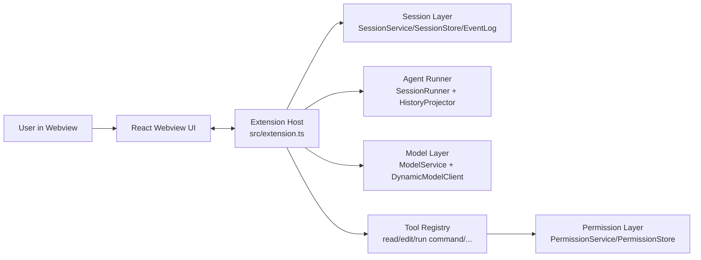

# Coding Agent (VS Code Extension)

This VS Code extension simulates a coding-agent loop: it receives prompts, reads code context, calls tools, requests approval for side effects, and responds in a chat panel.

## Core Architecture



### Processing Flow

1. The user submits a prompt from the webview.
2. `SessionService` records durable sessions/events.
3. `SessionRunner` builds context (including attached files) and calls the model.
4. If the model requests a tool (`read_file`, `grep`, `edit_file`, `run_command`, ...), the extension checks permissions via `PermissionService`.
5. Tool results are logged as events, and the agent continues until completion or interruption.

## Technology Stack

- Language: TypeScript
- Extension runtime: VS Code Extension API
- Webview UI: React 19 + ReactDOM
- Webview build: esbuild
- CSS: Tailwind CSS 4
- Markdown rendering: `react-markdown` + `remark-gfm`
- State storage: `workspaceState` + `SecretStorage` (for provider API keys)
- Current model providers:
  - Fake Local (for internal/testing use)
  - Gemini
  - Groq
  - Ollama

## Project Structure (Simplified)

```text
src/
  extension.ts                # Entry point extension + webview bridge
  core/
    session/                  # Session, event log, history projection, runner
    model/                    # Model service/client + provider adapters
    tools/                    # Tool registry + read/edit/command tools
    permission/               # Approval flow and permission rule storage
    context/                  # Resolve prompt context
  webview/                    # React app for the panel
```

## Run the Extension

### Requirements

- Node.js 20+ (latest LTS recommended)
- VS Code 1.100+

### Install and Build

```bash
npm install
npm run compile
```

### Run in Extension Development Mode

1. Open this project in VS Code.
2. Press `F5` (or `Run and Debug` -> `Start Debugging`).
3. A new **Extension Development Host** window will open.
4. In that window, run the command: `Coding Agent: Open Panel`.

### Run Tests

```bash
npm test
```

## Main Scripts

- `npm run compile`: build extension + typecheck/build webview
- `npm run watch`: watch and compile extension
- `npm test`: compile and run tests

## Quick Notes

- For a first run, you can use the `Fake Local` model to test the agent flow without an API key.
- For Gemini/Groq/Ollama, configure providers in the panel's model settings.
